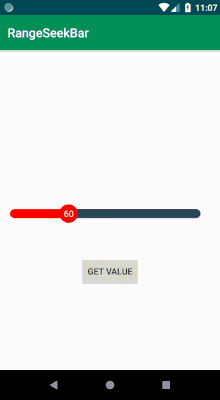

# RangeSeekBar
Android Range Seekbar library 
[](https://jitpack.io/#Mohammed-Alaa/RangeSeekBar)
[](https://www.apache.org/licenses/LICENSE-2.0)  
[](https://android-arsenal.com/details/1/7527)
## Usage

**For a working implementation of this project see the `app/` folder.**

### Step 1

Add this in your root build.gradle at the end of repositories
```groovy
allprojects {
		repositories {
			maven { url 'https://jitpack.io' }
		}
     
}
```

### Step 2

Include the library as a local library project or add the dependency in your build.gradle.

```groovy
dependencies {
    implementation 'com.github.Mohammed-Alaa:RangeSeekBar:1.0.4'
}
```	

### Step 3

Add the following xml to your layout file.

```xml
<com.mohammedalaa.seekbar.RangeSeekBarView
        android:id="@+id/range_seekbar"
        android:layout_width="match_parent"
        android:layout_height="wrap_content"     
        app:barHeight="@dimen/value_bar_barHeight"
        app:baseColor="@color/navy"
        app:circleRadius="@dimen/value_bar_circleRadius"
        app:circleTextColor="@color/white"
        app:circleTextSize="@dimen/value_bar_circleTextSize"
        app:fillColor="@color/red"
        app:currentValue="60"
        app:minValue="15"
        app:maxValue="150"
        app:stepValue="5"    
        />
```

### Step 4

Reference the View in Java code.

```kotlin
       RangeSeekBarView rangeSeekbar = (RangeSeekBarView) findViewById(R.id.range_seekbar);
```
Add Animation.
```kotlin
       rangeSeekbar.setAnimated(true,3000L);
```

Set Value
```kotlin
     rangeSeekbar.setCurrentValue(50)
```

Get Value
```kotlin
       rangeSeekbar.getCurrentValue();
```

Add SeekChangeListener
```kotlin
rangeSeekBarView.setOnRangeSeekBarViewChangeListener(object : OnRangeSeekBarChangeListener {
            override fun onProgressChanged(seekBar: RangeSeekBarView?, progress: Int, fromUser: Boolean) {

            }

            override fun onStartTrackingTouch(seekBar: RangeSeekBarView?) {

            }

            override fun onStopTrackingTouch(seekBar: RangeSeekBarView?) {

            }

        })
```

  
  
  ## License

    Copyright 2019 Mohammed Alaa
	Licensed under the Apache License, Version 2.0 (the "License");
	you may not use this file except in compliance with the License.
	You may obtain a copy of the License at

     http://www.apache.org/licenses/LICENSE-2.0

	Unless required by applicable law or agreed to in writing, software
	distributed under the License is distributed on an "AS IS" BASIS,
	WITHOUT WARRANTIES OR CONDITIONS OF ANY KIND, either express or implied.
	See the License for the specific language governing permissions and
	limitations under the License.
  
