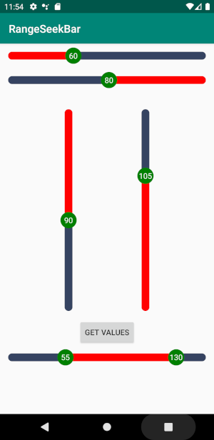

# RangeSeekBar
Android Range Seekbar library 
[](https://jitpack.io/#Mohammed-Alaa/RangeSeekBar)
[](https://www.apache.org/licenses/LICENSE-2.0)  
[](https://android-arsenal.com/details/1/7527)
## Usage

**For a working implementation of this project see the `app/` folder.**

### Step 1

Add this in your root build.gradle at the end of repositories
```groovy
allprojects {
    repositories {
        maven { url 'https://jitpack.io' }
    }     
}
```

---
### Step 2

Include the library as a local library project or add the dependency in your build.gradle.

```groovy
dependencies {
    implementation 'com.github.MohammedAlaaMorsi:RangeSeekBar:1.0.6'
}
```
---
### Step 3

Add the following xml to your layout file.

   ## RangeSeekBarView
```xml
<com.mohammedalaa.seekbar.RangeSeekBarView
        android:id="@+id/range_seekbar"
        android:layout_width="match_parent"
        android:layout_height="wrap_content"
        app:barHeight="15dp"
        app:baseColor="@color/navy"
        app:circleFillColor="@color/green"
        app:circleRadius="15dp"
        app:circleTextColor="@color/white"
        app:circleTextSize="@dimen/value_bar_circleTextSize"
        app:currentValue="60"
        app:fillColor="@color/red"
        app:layout_constraintEnd_toEndOf="parent"
        app:layout_constraintStart_toStartOf="parent"
        app:layout_constraintTop_toTopOf="parent"
        app:maxValue="150"
        app:minValue="15"
        app:orientation="LEFT_TO_RIGHT"
        app:stepValue="5" />
```
  ## DoubleValueSeekBarView
```xml
  <com.mohammedalaa.seekbar.DoubleValueSeekBarView
          android:id="@+id/double_range_seekbar"
          android:layout_width="match_parent"
          android:layout_height="wrap_content"
          app:layout_constraintEnd_toEndOf="parent"
          app:layout_constraintStart_toStartOf="parent"
          app:r2CurrentMaxValue="140"
          app:r2CurrentMinValue="30"
          app:r2barHeight="15dp"
          app:r2baseColor="@color/navy"
          app:r2circleFillColor="@color/green"
          app:r2circleRadius="15dp"
          app:r2circleTextColor="@color/white"
          app:r2circleTextSize="@dimen/value_bar_circleTextSize"
          app:r2fillColor="@color/red"
          app:r2maxValue="150"
          app:r2maxValueStep="10"
          app:r2minValue="15"
          app:r2minValueStep="5" />

```
---
### Step 4

Reference the View in Kotlin code.

  ## RangeSeekBarView
* Kotlin
```kotlin
val rangeSeekbar = findViewById<RangeSeekBarView>(R.id.range_seekbar)
```
* Java
```Java
RangeSeekBarView rangeSeekbar=findViewById(R.id.range_seekbar);
```
  ## DoubleValueSeekBarView
* Kotlin
```kotlin
val doubleValueRangeSeekbar = findViewById<DoubleRangeSeekBarView>(R.id.double_range_seekbar)
```
* Java
```Java
DoubleRangeSeekBarView doubleValueRangeSeekbar = findViewById(R.id.double_range_seekbar)
```
Add Animation.

   ## RangeSeekBarView
```kotlin
rangeSeekbar.setAnimated(true,3000L);
```

Set Value
   ## RangeSeekBarView
* Kotlin
```kotlin
rangeSeekbar.currentValue=50
```
* Java
```Java
rangeSeekbar.setCurrentValue(50)
```
   ## DoubleValueSeekBarView
* Kotlin
```kotlin
doubleValueSeekBarView.currentMinValue=50
doubleValueSeekBarView.currentMaxValue=140
```
* Java
```Java
doubleValueSeekBarView.setCurrentMinValue(50)
doubleValueSeekBarView.setCurrentMaxValue(140)
```
Get Value

  ## RangeSeekBarView
* Kotlin
```kotlin
rangeSeekbar.currentValue
```
* Java
```Java
rangeSeekbar.getCurrentValue()
```
  ## DoubleValueSeekBarView
* Kotlin
```kotlin
doubleValueSeekBarView.currentMinValue
doubleValueSeekBarView.currentMaxValue
```
* Java
```Java
doubleValueSeekBarView.getCurrentMinValue()
doubleValueSeekBarView.getCurrentMaxValue()
```
Add SeekChangeListener

   ## RangeSeekBarView
* Kotlin
```kotlin
rangeSeekBarView.setOnRangeSeekBarViewChangeListener(object : OnRangeSeekBarChangeListener {
            override fun onProgressChanged(seekBar: RangeSeekBarView?, progress: Int, fromUser: Boolean) {

            }

            override fun onStartTrackingTouch(seekBar: RangeSeekBarView?) {

            }

            override fun onStopTrackingTouch(seekBar: RangeSeekBarView?) {

            }

        })
```
* Java
```Java
rangeSeekBarView.setOnRangeSeekBarViewChangeListener(new OnRangeSeekBarChangeListener() {
            @Override
            public void onProgressChanged(@Nullable RangeSeekBarView seekBar, int progress, boolean fromUser) {

            }

            @Override
            public void onStartTrackingTouch(@Nullable RangeSeekBarView seekBar, int progress) {

            }

            @Override
            public void onStopTrackingTouch(@Nullable RangeSeekBarView seekBar, int progress) {

            }
        });
```
   ## DoubleValueSeekBarView
* Kotlin
```kotlin
doubleValueSeekBarView.setOnRangeSeekBarViewChangeListener(object : OnDoubleValueSeekBarChangeListener {
                override fun onValueChanged(seekBar: DoubleValueSeekBarView?, min: Int, max: Int, fromUser: Boolean) {
                }

                override fun onStartTrackingTouch(seekBar: DoubleValueSeekBarView?, min: Int, max: Int) {
                }

                override fun onStopTrackingTouch(seekBar: DoubleValueSeekBarView?, min: Int, max: Int) {
                }
            })
```
* Java
```Java
doubleValueSeekBarView.setOnRangeSeekBarViewChangeListener(new OnDoubleValueSeekBarChangeListener() {
            @Override
            public void onValueChanged(@Nullable DoubleValueSeekBarView seekBar, int min, int max, boolean fromUser) {

            }

            @Override
            public void onStartTrackingTouch(@Nullable DoubleValueSeekBarView seekBar, int min, int max) {

            }

            @Override
            public void onStopTrackingTouch(@Nullable DoubleValueSeekBarView seekBar, int min, int max) {

            }
        });
```

---
### CHANGELOG
See [CHANGELOG](https://github.com/MohammedAlaaMorsi/RangeSeekBar/blob/master/CHANGELOG.md) for detailed list of changes

<p float="left">


</p>

  ## License

    Copyright 2019 Mohammed Alaa
	Licensed under the Apache License, Version 2.0 (the "License");
	you may not use this file except in compliance with the License.
	You may obtain a copy of the License at

     http://www.apache.org/licenses/LICENSE-2.0

	Unless required by applicable law or agreed to in writing, software
	distributed under the License is distributed on an "AS IS" BASIS,
	WITHOUT WARRANTIES OR CONDITIONS OF ANY KIND, either express or implied.
	See the License for the specific language governing permissions and
	limitations under the License.
